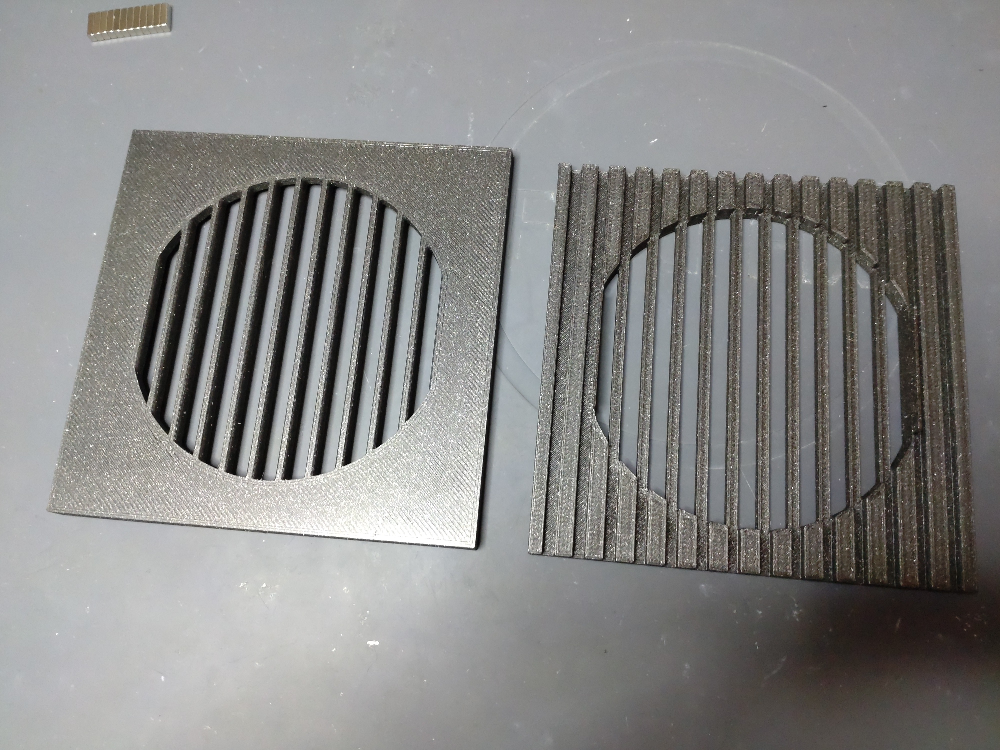
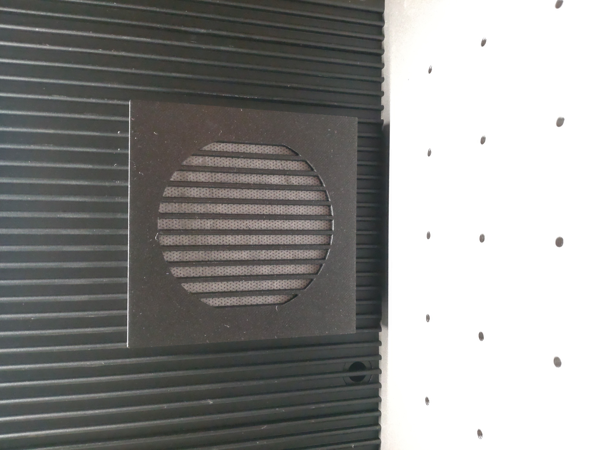
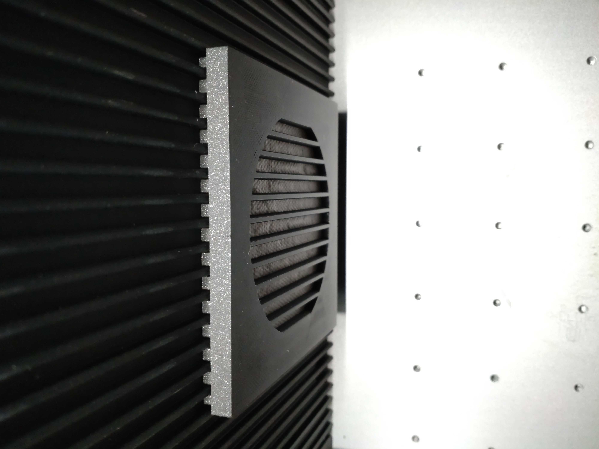

# xTool-F1-Ultra-Pre-Filter
3D printable Pre-Filter for the xTool F1 Ultra Laser. Created with Rhino 7. 

The Pre-Filter consist of 2 parts which are held together with 8 neodym magnets. 
Just press the magnets inside the holes. Be carefull with the direction of the magnets.
You can clamp the bottom part to the fan hole of the F1 Ultra. Use a thin  
air-permeable fabric as a filter for bigger particles. 

Requirements:
* 3D printer 
* PETG Filament of your choice (PLA may work too but it's not as stable as PETG)
* 8x 8 mm * 3 mm * 2 mm

## View

 

  

